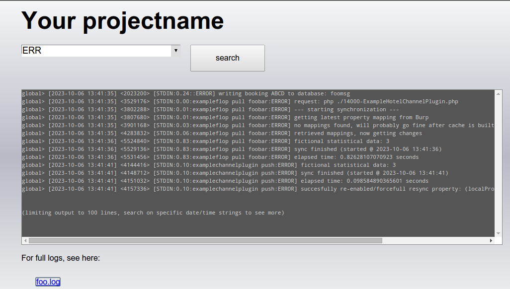

multiple-logfiles-grep-webinterface
===================================

deadsimple phpfile which allows grepping on logfiles using a browser (handy for collegues e.g.)

## Why

To prevent developers becoming a middle-man-for-support.

## But Why?

Sometimes there's no budget/time for developers to move their logfiles to something more robust (logging webservices e.g.), 
and/or to create email notifications for (many times unknown) situations.
Logging to a file, however is usually the 'poor mans'-history for developers.

## How to use it?

Easy:

* Put the files into your rootdirectory
* change the 'login' and 'password' in `log.php`
* point to the appropriate logfiles in `cli/greplogs`
* point collegues to https://yourdomain.com/log.php
* ask them to disturb you *after* checkin the logs

Voila!

## Tip

use php's syslog() instead of writing to a file, because:

* it ends up in /var/log/messages
* it automatically rotates your files
* it allows you to trigger email notifications upon certain stringpatterns
* it's reliable (files are not, think race-conditions e.g.)

Eventually you can look in to online logging tools if the volumes become huge.
